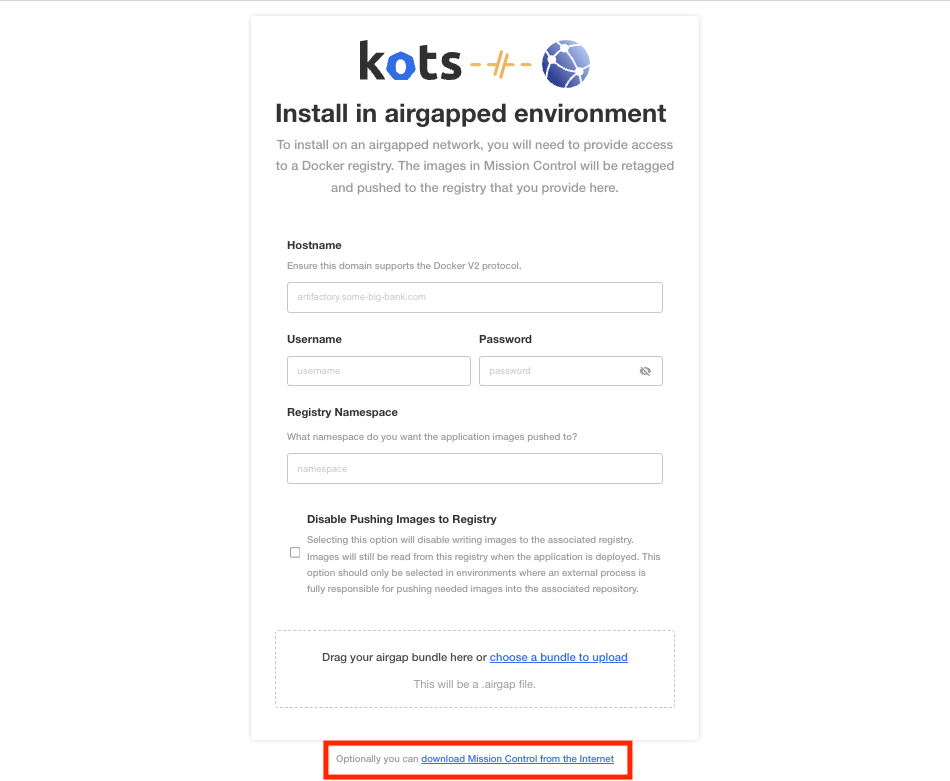
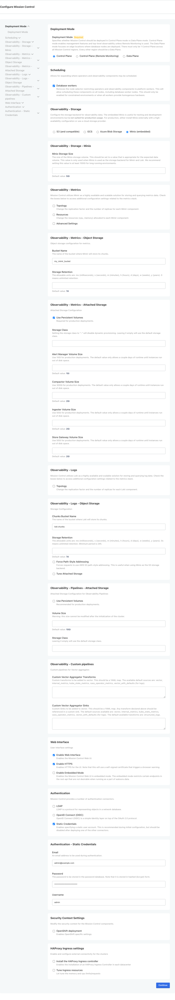

# **Setup DataStax Mission Control on macOS with Kind**

This guide walks you through setting up **DataStax Mission Control** on a **local Kubernetes cluster** using **Kind (Kubernetes in Docker)** on macOS.

With this setup, you can explore, test, and demo **Mission Control-managed** **Cassandra**, **DataStax Enterprise (DSE)**, and **Hyperconverged Database (HCD)** clusters directly on your local machine.

---

## **Prerequisites**
Ensure you have the following installed on your Mac:

- [Docker](https://www.docker.com/get-started/)  
  Ensure you configure **sufficient resources** for Docker. I have **30 GB RAM and 12 CPUs** allocated for the Docker engine.
- [kubectl](https://kubernetes.io/docs/tasks/tools/install-kubectl-macos/)
- [Helm](https://helm.sh/docs/intro/install/)
- [Kind](https://kind.sigs.k8s.io/docs/user/quick-start/)

---

## **1. Create a Kind Cluster**
### **1.1 Define the Kind Cluster Configuration**
Use the file [kind.yaml](kind.yaml) with the following contents to create a local Kubernetes **Kind** cluster:

```yaml
kind: Cluster
apiVersion: kind.x-k8s.io/v1alpha4
networking:
  apiServerPort: 45451
nodes:
- role: control-plane
  image: kindest/node:v1.32.2
  labels:
    mission-control.datastax.com/role: platform
  extraPortMappings:
    - containerPort: 30880
      hostPort: 30880
      listenAddress: "0.0.0.0"
      protocol: tcp
    - containerPort: 30081
      hostPort: 30081
      listenAddress: "0.0.0.0"
      protocol: tcp
    - containerPort: 30001
      hostPort: 30001
      listenAddress: "0.0.0.0"
      protocol: tcp

- role: worker
  image: kindest/node:v1.32.2
  labels:
    mission-control.datastax.com/role: platform
- role: worker
  image: kindest/node:v1.32.2
  labels:
    mission-control.datastax.com/role: platform
- role: worker
  image: kindest/node:v1.32.2
  labels:
    mission-control.datastax.com/role: platform
```

### **1.2 Deploy the Kind Cluster**
Run the following command to create the cluster:
```sh
kind create cluster --config kind.yaml
```

Verify that the cluster is running:
```sh
kubectl get nodes
```

---

## **2. Install Cert-Manager**
Cert-Manager is required for issuing TLS certificates in the cluster.

### **2.1 Add the Jetstack Helm Repository**
```sh
helm repo add jetstack https://charts.jetstack.io --force-update
helm repo update
```

### **2.2 Install Cert-Manager**
```sh
helm install \
  cert-manager jetstack/cert-manager \
  --namespace cert-manager \
  --create-namespace \
  --version v1.16.1 \
  --set installCRDs=true
```

---

## **3. Install DataStax Mission Control**
### **3.1 Install KOTS (Kubernetes Off-The-Shelf)**
KOTS is required for managing Mission Control installations.

Run the following command to install KOTS:
```sh
curl https://kots.io/install | REPL_INSTALL_PATH=/DEFINE_YOUR_PATH bash
```

Verify that KOTS is installed:
```sh
kubectl kots version
```

### **3.2 Deploy Mission Control**
```sh
kubectl kots install mission-control --namespace mission-control
```

### **3.3 Configure Mission Control**
1. **Enter a password for the Admin Console** when prompted.
2. Open your browser and go to:  
   🔗 **[http://localhost:8800](http://localhost:8800)**
3. Enter the **password** you created.

   

4. **Register for a community edition license** at:  
   🔗 **[DataStax Mission Control Download](https://www.datastax.com/products/mission-control/download)**
5. **Upload your license file** in the UI.

      

6. Click **"Download Mission Control from the Internet."**

    

7. **Generate a password** for Mission Control login:
   ```sh
   echo password | htpasswd -BinC 10 admin | cut -d: -f2
   ```
   Example output:
   ```
   $2y$10$NUI5VjziPkOEQi2WVjlVOuzllzmy6gyAsts4T5YchHXejwwlJB4.a
   ```
8. **Copy the generated password** into the password field.
9. Review and confirm the configuration.

      

10. Click **"Continue"** and then **"Deploy."**

---

## **4. Access the Mission Control Admin Console**
If the **port forwarding session stops**, restart it using:
```sh
kubectl kots admin-console -n mission-control
```

### **4.1 Open in Browser**
Once running, access **Mission Control UI** in your browser:

🔗 [https://localhost:30880/](https://localhost:30880/)

Log in with the **email address and password** you created earlier.

   

---

## **5. Create an HCD Cluster Using Mission Control UI**
### **5.1 Create a Project**
Click **Create a Project**. This creates a **Kubernetes namespace** where all clusters will be deployed.

   

Check available namespaces:
```sh
kubectl get namespaces
```
   

### **5.2 Deploy a New Cluster**
1. Click **"Create a New Cluster"**  
   
2. Click **"Expert Mode"** to see the **YAML configuration**.
   
3. Click **"Deploy"**  
4. Select your cluster and monitor its creation.
   

### **5.3 Monitor Cluster Creation**
Check progress using:
```sh
kubectl get pods -n demo-1wx3a235 -w
```


Once the cluster is running, you can manage it via the **Mission Control UI**.


### **5.4 Deploy Multiple Database Clusters**
Find the YAML files:  
- [`dse.yaml`](dse.yaml)
- [`cassandra.yaml`](cassandra.yaml)
- [`hcd.yaml`](hcd.yaml)

By default, only **one database node per Kubernetes worker node** is allowed.  
To deploy **multiple nodes per worker node**, enable **softPodAntiAffinity** and **configure CPU & memory requests/limits**:

```yaml
softPodAntiAffinity: true
resources:
  requests:
    cpu: "1000m"
    memory: "2Gi"
  limits:
    cpu: "1000m"
    memory: "3Gi"
```

---

## **6. Troubleshooting**
### **Check Pod Status**
```sh
kubectl logs -n <NAMESPACE> <POD_NAME>
```
Example:
```sh
kubectl logs -n demo-1wx3a235 hcd-dc-1-0
```

### **Restart Port Forwarding**
```sh
kubectl kots admin-console -n mission-control
```

### **Delete the Kind Cluster**
If needed, delete the cluster:
```sh
kind delete cluster
```
If `kind delete cluster` is **unresponsive**, remove Docker containers manually:
```sh
docker rm -f $(docker ps -aq --filter "name=kind")
docker network rm kind
```

---

## **Conclusion**
You have successfully set up **DataStax Mission Control** on macOS using **Kind**. 🎉  
You can now manage Cassandra clusters using the **Mission Control UI**.