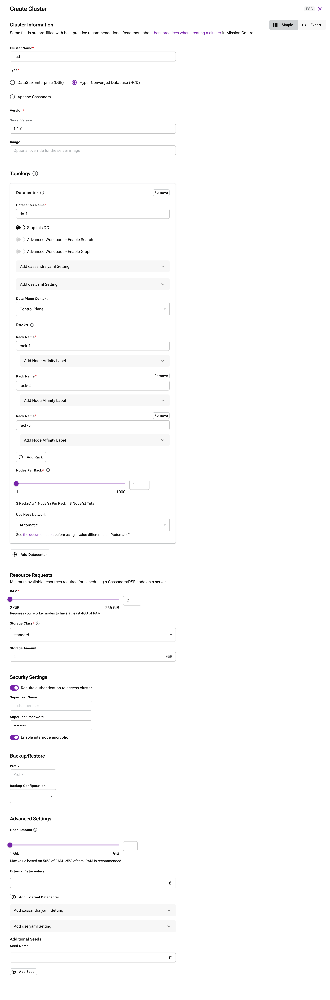
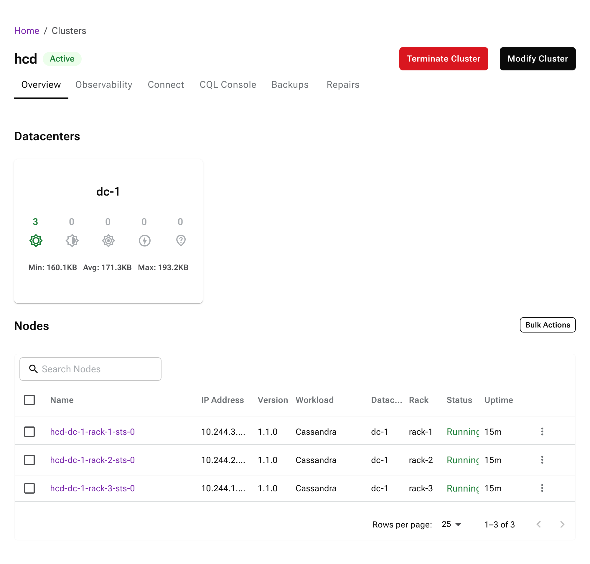

# DataStax Mission Control and Hyper-Converged Database (HCD) Workshop Guide

## Workshop Overview

**DataStax Mission Control** is a unified management platform for Apache Cassandra® and DataStax databases, providing a “single pane of glass” to deploy, monitor, and manage Cassandra clusters across any environment. Mission Control offers a centralized web console and automation via Kubernetes operators, enabling operations teams to manage many database clusters from one place without manual per-node work. Key capabilities include one-click cluster provisioning, integrated monitoring and logging, automated repairs, backup/restore, and seamless upgrades – all following best practices drawn from years of running Cassandra at scale. In practical terms, Mission Control leads to faster deployments, easier day‑2 operations (like scaling and repairs), and **zero-downtime maintenance** through orchestrated rolling upgrades.

**DataStax Hyper-Converged Database (HCD)** is a next-generation self-managed database built on Apache Cassandra. HCD extends Cassandra with **cloud-native enhancements** and new capabilities (such as integrated **vector search** for AI/ML applications) while unifying transactional and analytical workloads in one database. It is designed for modern data centers and AI-ready infrastructure, allowing enterprises to run high-performance Cassandra-based databases with built-in support for vector storage and similarity search. HCD includes Mission Control for deploying and operating clusters on Kubernetes, bringing cloud-like automation to on-premises or hybrid environments. In short, HCD offers the power and scale of Cassandra with easier operations and built-in integration for emerging use cases like generative AI.

**Value Proposition & Use Cases:** Together, Mission Control and HCD provide significant value for teams managing Cassandra or DataStax Enterprise (DSE) clusters:

* **Unified Management:** Mission Control serves as a single control plane for all your Cassandra/DSE/HCD clusters across on-premises, cloud, or hybrid setups. This consolidation means no more juggling separate tools (e.g., OpsCenter for metrics, custom scripts for deployments) – everything is managed in one UI or via one CLI. Administrators can view and control every cluster from a central dashboard, improving efficiency and reducing complexity.

* **Rapid Provisioning & Scaling:** Mission Control automates Cassandra cluster deployment on Kubernetes, cutting setup time from days to minutes. Teams can spin up new clusters or add capacity with a few clicks or a simple YAML change. This agility supports use cases like on-demand test clusters, auto-scaling for peak loads, and quicker onboarding for new projects. For example, a development team could request a **Cassandra-as-a-Service** instance and get a running cluster in minutes, rather than waiting for manual provisioning.

* **Reduced Operational Overhead:** Common maintenance tasks that normally require manual steps and careful scheduling – adding nodes, replacing failed nodes, running repairs, taking backups, etc. – are handled by Mission Control’s automation. For example, backups use the **Medusa** tool under the hood and repairs are managed by **Cassandra Reaper**, but ops teams don’t have to set those up separately. The automation ensures these tasks are done correctly and consistently, reducing the risk of human error and saving operator time.

* **Zero-Downtime Updates:** Mission Control enables rolling upgrades of Cassandra/DSE/HCD versions and rolling configuration changes **without downtime**. It sequentially updates one node at a time, automating what DBAs used to do manually (drain node, upgrade, reboot, repeat). This means you can apply patches and updates in production during business hours while maintaining continuous service availability – a huge win for mission-critical applications that can’t afford extended outages.

* **Integrated Observability:** Out-of-the-box, Mission Control provides robust monitoring and alerting tailored to Cassandra clusters. It deploys a metrics collection stack (Prometheus) and aggregates logs from all nodes, presenting them in a unified dashboard. Ops teams get immediate visibility into cluster health (e.g. read/write throughput, latency, node status) and can troubleshoot issues from the Mission Control UI without SSHing into servers. Alerts can be configured for key conditions (node down, high CPU, disk usage, etc.), enabling proactive issue detection with notifications (for example, via Slack integrations).

* **Representative Use Cases:** This combined solution is ideal for enterprises modernizing their Cassandra deployments. Example use cases include deploying **Cassandra-as-a-Service** internally on Kubernetes for various teams, managing geo-distributed clusters with a centralized tool, ensuring high uptime for customer-facing databases through automated failover and repairs, and integrating real-time **AI/ML workloads** with vector search on a scalable NoSQL backend (using HCD’s vector capabilities). HCD’s support for both traditional relational-style data and AI vector embeddings makes it versatile for applications from IoT and e-commerce to GenAI-powered services – and Mission Control makes these deployments operationally feasible at scale.

## Workshop Setup and Environment

**Kubernetes Environment:** In this workshop, DataStax Mission Control is deployed on a Kubernetes cluster which serves as the **control plane** for managing Cassandra/HCD. For simplicity, the control plane and data plane will be the same K8s cluster in our setup (for example, an Amazon EKS cluster or a local KinD cluster), meaning the Cassandra nodes will be launched as pods in this Kubernetes cluster. This unified approach is easier for workshop purposes, though Mission Control can also manage external data planes if needed.

> 🛠️ *Attendees are expected to install Mission Control as part of the workshop exercises.* (If you haven’t, refer to the provided setup instructions before proceeding with the labs.)

Some setup resources and examples used for this workshop:

* **Local Mission Control Setup (KinD):** See the GitHub repo with step-by-step instructions: [Mission Control Local Setup README](https://github.com/difli/mission-control-local-setup/blob/main/README.md) and the [EC2/KinD setup guide](https://github.com/difli/mission-control-local-setup/blob/main/ec_2_mission_control_setup.md). This demonstrates installing Mission Control using KOTS (Kubernetes Off-The-Shelf) in a local environment or on an EC2 instance.

* **Helm/Terraform EKS Setup:** For a more production-like install, see the Terraform scripts for AWS EKS in [tf-aws-mission-control](https://github.com/Scharlotten/tf-aws-mission-control). This uses Helm charts to deploy Mission Control onto an AWS EKS cluster, automating the cluster creation and Mission Control installation.

With Mission Control up and running on Kubernetes, we’re ready to manage database clusters through it. The following labs will guide you through common operations using Mission Control and HCD.

## Key Concepts: Kubernetes and Mission Control Architecture

Before diving into the hands-on labs, let’s recap a few key concepts that explain how Mission Control manages Cassandra/HCD on Kubernetes:

* **Kubernetes Constructs for Cassandra:** Mission Control leverages Kubernetes to orchestrate database clusters. Each Cassandra node runs in a Kubernetes **Pod** (with the Cassandra process in a container). Cassandra nodes in a datacenter are managed as a **StatefulSet**, which ensures each node (pod) has a stable network identity and persistent storage. A Kubernetes **Service** is used to expose the Cassandra seed nodes for cluster discovery and to route client traffic. Mission Control defines Cassandra/HCD clusters via Kubernetes **Custom Resources** – specifically a `MissionControlCluster` CustomResourceDefinition (CRD) – which describes the desired state (number of datacenters, nodes per datacenter, version, etc.). Mission Control’s **operators** (custom controllers running in Kubernetes) watch these resources and perform actions to reconcile the actual state of the cluster to the desired state. In essence, Kubernetes provides the automation backbone: if a Cassandra pod fails, the StatefulSet will restart it; if we update the cluster definition, the operator will apply those changes across the cluster.

* **Mission Control Architecture (Control Plane vs Data Plane):** Mission Control is deployed in a **Control Plane / Data Plane** architecture. The **Control Plane** is the Mission Control application itself (running in Kubernetes, typically in a `mission-control` namespace) that includes the web UI, REST API, and various control components (the Mission Control operators and supporting services). It can manage multiple **projects** and clusters. A **Project** in Mission Control is simply a logical grouping of clusters (e.g. by environment or team) to help organize resources. In our workshop, a project named “Workshop” is used to contain the demo cluster(s). The **Data Plane** refers to the actual database cluster infrastructure. In many cases (like this workshop), the data plane is the same Kubernetes cluster where Mission Control is running, and Cassandra pods are launched there. (Mission Control can also manage clusters on separate data plane Kubernetes clusters, or even on VMs via remote operators, but our focus is on Kubernetes-based deployment which is typical for HCD.)

* **Integrated Services:** Mission Control bundles several Cassandra operational tools into its platform to provide a comprehensive management solution. It includes a **metrics collector** (built on Prometheus) that scrapes metrics from each Cassandra node, and a **log aggregator** (using Grafana Loki or a similar logging stack) to collect and centralize logs. These feed into Mission Control’s UI dashboards. For repairs, Mission Control integrates **Cassandra Reaper** (an open-source repair coordinator) so that you can run or schedule anti-entropy repairs from the Mission Control UI without a separate Reaper installation. For backups, Mission Control uses **Medusa** under the hood – a backup service that coordinates Cassandra snapshots and uploads them to cloud or on-prem object storage. These components (metrics, logging, repairs, backup) are deployed as part of Mission Control’s control plane (often as separate pods or microservices). The benefit is that operators get a “batteries-included” experience – you don’t need to manually set up Grafana, Prometheus, or custom scripts for repairs and backups; Mission Control provides turnkey solutions for full cluster observability and maintenance.

* **Declarative Management:** A core principle of Mission Control (inherited from Kubernetes) is **declarative configuration**. You declare the desired state of the cluster (for example, “a datacenter `dc1` with 3 nodes of version X”) and Mission Control’s operators continuously **reconcile** the actual cluster to match that desired state. If you want to change something – e.g., add a node, change a configuration parameter, or upgrade to a new version – you update the declaration (via the UI or by applying a YAML manifest), and the system handles applying those changes in a safe and automated way. This approach applies to everything: scaling, config changes, software upgrades, etc., ensuring consistency and repeatability. For instance, changing a config parameter in the cluster CR will trigger a rolling restart of nodes to apply it safely across the cluster. As operators, this means we spend less time on manual procedures and more time supervising (or automating) higher-level policies. Essentially, Mission Control encapsulates a lot of Cassandra operational expertise and best practices, so your clusters remain in a known-good state even as changes are applied.

With these concepts in mind, let’s proceed to the hands-on labs. Each lab will walk through a different Mission Control capability using HCD (or Cassandra/DSE) in a Kubernetes environment.

---

## Lab 1: Mission Control Installation and Setup (Pre-Lab)

*Objective:* Verify that DataStax Mission Control is up and running, and familiarize yourself with the environment before creating a database cluster.

**Step 1 – Access the Mission Control UI:** Open your web browser to the Mission Control interface. If you’re running Mission Control locally (for example, via KinD), you may need to port-forward the service to access the UI. For instance, you could run:

```bash
kubectl port-forward svc/mission-control-ui -n mission-control 8080:80
```

Then browse to `http://localhost:8080`. In a cloud deployment (like on EKS), you might have a LoadBalancer service or ingress – use the provided URL or IP. Log in with the admin credentials set during installation. (For the Mission Control Community Edition, the default admin username/email is `admin@example.com` with a password you set or that was provided during install.) Once logged in, you should see the Mission Control dashboard – a web console with a sidebar for Projects and a main area for cluster information and status.

**Step 2 – Create or Select a Project:** In the left sidebar, locate the **Projects** section. Projects help organize clusters by team, environment, or purpose. If a “Workshop” project (or a specific project for this lab) has already been created, click on it to enter that context. Otherwise, create a new project using the “New Project” button and give it a name (e.g., “Workshop”). Within a project, you will later create one or more clusters. Ensuring you have the correct project selected will keep our work isolated and organized.

> **About Projects:** A project in Mission Control is purely a logical grouping of clusters and doesn’t affect how those clusters are deployed or run. It’s useful in multi-tenant scenarios or when separating resources (for example, a Production project vs. a Development project). In our case, using a single “Workshop” project for all demo clusters keeps everything in one place for simplicity.

---

## Lab 2: Creating a Cassandra/HCD Cluster with Mission Control

In this lab, we will create a new Cassandra cluster (using DataStax HCD) through the Mission Control UI. This demonstrates how easy it is to spin up a fully configured Cassandra cluster with just a few clicks, compared to manual provisioning.

**Step 3 – Start Cluster Creation:** In the Mission Control UI, make sure your project (e.g., “Workshop”) is selected. Click the **“Create Cluster”** button. This will open a cluster provisioning wizard or form. If prompted to choose between modes, select the **“Simple” (GUI) mode** for cluster creation (as opposed to the expert YAML mode). The Simple mode provides a form-driven experience for defining your cluster.

**Step 4 – Enter Cluster Details:** Fill out the cluster creation form with the desired settings:

* **Cluster Name:** Enter a name for your cluster, for example **`demo-cluster`** (cluster names must be unique and DNS-friendly; once set, the name cannot be changed).
* **Cluster Type:** Select **DataStax Hyper-Converged Database (HCD)** as the database type.
* **Server Version:** Choose the version of HCD to deploy, for example **HCD 1.1.0** (or the latest available version in the dropdown). *(Mission Control also supports deploying Apache Cassandra or DataStax Enterprise clusters through this interface, but we’ll use HCD for this exercise.)*
* **Topology & Size:** Define the datacenter and node layout. For this lab, configure a single datacenter:

  * **Datacenter Name:** e.g., `dc1` (you can use any name; note that datacenter names in Cassandra must be a single word, no spaces).
  * **Rack (Zone) Configuration:** If prompted for a rack name, enter `rack1` (or use the default). We will use one rack for simplicity.
  * **Nodes per Rack:** Set **3 nodes** for `rack1`. This will create a 3-node cluster in one datacenter. Three nodes is a common minimal cluster size that still provides replication (RF=3) for fault tolerance.
* **Storage and Hardware:** Select a storage class for persistent volumes if required. Use the default provided by your Kubernetes cluster (for example, on EKS this might be “gp2”, on a local KinD cluster it might be “standard”). Enter the storage amount per node (e.g., 10 or 20 GB for a workshop environment). Also specify resource requests if the form asks (the default might be 4 CPU / 4 GB RAM per node; for a demo you can leave defaults).
* **Configuration Settings:** Mission Control will apply a default `cassandra.yaml` configuration suitable for HCD/Cassandra. You typically do not need to add custom configuration for a basic deployment. (There is usually an option to add custom Cassandra configuration entries, but we will skip that and use the default settings which are fine for now.)
* **Security Settings:** For this workshop cluster, you can leave authentication and encryption at their defaults. (In production, you would enable **Password Authentication** and supply a superuser name and password, and possibly enable **TLS encryption** for internode and client traffic. For simplicity in our lab, we may use the default credentials or an easy superuser password.)
* **Backup Settings:** You may see options to configure backup storage or schedules. We will configure backups later, so you can skip or leave these as default for now (unless a default backup configuration is required by the form).

Review the form and ensure all required fields are filled in. At this point, your screen should look similar to the following example, with the cluster name, type (HCD), version selected, one datacenter (`dc1`) with 3 nodes defined, and default storage/config options:



**Step 5 – Launch the Cluster:** Click **“Create”** (or the final **Submit**) to create the cluster. Mission Control will begin deploying the Cassandra cluster in the background. The UI will navigate to a cluster status or overview page for the new cluster, which will show a progress indicator or status messages. Initially, you will see the cluster state as **Provisioning** (or similar). The UI will list the datacenter (`dc1`) and the nodes (often numbered as node0, node1, node2), each with a status indicator. At first, each node may show as “Initializing” or “Pending” as Kubernetes schedules the pods and they start up.

Behind the scenes, Mission Control has created the necessary Kubernetes resources for your cluster. Specifically, it generated a `MissionControlCluster` custom resource manifest that describes your intended cluster. The Cassandra operator (part of Mission Control) noticed this and in turn created a **StatefulSet** with 3 pods for the `dc1` datacenter. Kubernetes is now pulling the HCD Cassandra container image (for version 1.1.0) for each pod, attaching persistent volumes for data storage, and configuring each Cassandra node (setting the cluster name, seed list, `cassandra.yaml` settings, etc.) automatically. Mission Control’s control plane continuously monitors this process and will report progress until the cluster’s actual state (3 running Cassandra nodes) matches the desired state you specified.

> *Note:* In a traditional setup, at this point an administrator would be provisioning three servers or VMs, installing Java and Cassandra on each, configuring each node’s settings (ensuring they have the same cluster name, setting seed nodes, etc.), and then starting the Cassandra service on each and making sure they form a cluster. Mission Control automated all of those steps for us via Kubernetes – we simply declared what we wanted, and the operators and Kubernetes did the heavy lifting. This drastically reduces setup time and ensures consistency across deployments.

**Step 6 – Monitor Cluster Startup:** While the cluster is provisioning, observe its status. In the Mission Control UI’s cluster view, you should see a list of the 3 nodes and their current status updating in real-time. Each node will go through states like **Initializing/Starting** and then **Running** as the Cassandra process comes online. Within a few minutes, all three nodes should reach an **Active/Running** state.



Once the UI indicates all nodes are **Up** (usually shown in green or with a checkmark), the cluster is fully deployed. You can click around the cluster details to see information such as the cluster name, datacenter name (`dc1`), the server version (e.g., HCD 1.1.0), and the number of nodes. Congratulations – you just deployed a multi-node Cassandra cluster with essentially one action!

**Step 7 – Verify Cluster Health:** On the cluster’s overview/status page, confirm that each node is reporting healthy and up. Mission Control will flag any issues if, for example, a node failed to start (you would see a warning or error status). In our case, all nodes should be running normally. The cluster is now ready for use. At this point, one could connect an application or the CQL shell to the cluster to create keyspaces and tables. However, our focus in this workshop will be on using Mission Control to manage the cluster rather than interacting with it directly via CQL.

*What happened under the hood?* Mission Control and Kubernetes handled all the cluster setup steps automatically. The Cassandra nodes discovered each other (the operator set up the seed node configuration), and Cassandra’s gossip protocol formed a ring. If you were to run `nodetool status` on one of the nodes, you would see all three nodes listed as UN (Up/Normal) with token ranges distributed among them. The entire process is repeatable and consistent – for example, you could create another cluster (say, for a different project or use case) just as easily, and Mission Control would orchestrate it in parallel without conflicts. This ease of provisioning means teams can stand up dev/test clusters on demand and ensure that even production clusters are built exactly to specification every time.

**Step 8 – (Optional) Enable and Test the Data API:** HCD comes with an optional RESTful **Data API** (powered by **Stargate**) that allows you to interact with the database over HTTP (using REST, GraphQL, or Document APIs) instead of CQL. Let’s demonstrate how to enable the Data API for our new cluster.

* *Enable the Data API Gateway:* In the Mission Control UI, navigate to the cluster’s **Connect** page (often a tab or section in the cluster view). Within the Connect page, find the **APIs** section. Here you can manage Data API gateways for the cluster. Click **“Add Gateway”**. In the dialog:

  * Select the datacenter (choose **dc1** if prompted for which datacenter to expose).
  * For **Replicas**, enter **1** (one Stargate node is sufficient for development/testing; in production you might run 2+ for HA).
  * For **Service Type**, choose **NodePort** (this will expose the API on a port accessible outside the cluster nodes; the other option is ClusterIP which is internal-only).
  * For **Port Number**, specify a port in the 30000-32767 range (the NodePort range). For example, enter ****.
  * Click **Add Gateway** to deploy the Data API gateway.

  Mission Control will now deploy a Stargate Data API pod (or pods) in the cluster’s namespace. Within a minute, you should see a new pod (and a service) for the Data API. Once it’s running, the Data API gateway is active. The UI will list the gateway (with the datacenter and port info) in the APIs section.

* *Access the Data API:* Since we chose a NodePort service on port 30001, the Data API can be reached at `http://<NodeIP>:30001` where `<NodeIP>` is the IP or DNS of any Kubernetes worker node in your cluster. If your Kubernetes cluster nodes are not directly accessible (e.g., in a cloud or if you’re using KinD locally), you can port-forward this service to your local machine for testing. For example:

  ```bash
  # Port-forward the Data API pod to localhost for testing
  kubectl port-forward -n <cluster-namespace> pod/<your-data-api-pod-name> 30001:8082
  ```

  (In many cases the Stargate gateway listens on port 8082 or 8181 internally; the exact target port might depend on the configuration. Mission Control documentation indicates the default for HCD’s Data API is port 8082 for the REST API. We use 8082 in this example.)

  Replace `<cluster-namespace>` with the Kubernetes namespace where your cluster’s pods are running (Mission Control typically creates a unique namespace for each cluster, such as `demo-cluster-namespace`). Replace `<your-data-api-pod-name>` with the actual name of the Data API pod (you can find it by running `kubectl get pods -n <cluster-namespace>`; it will have a name like `demo-cluster-dc1-stargate-...` or `...-data-api-...`).

  Now, with the port-forward in place, open a browser to **[http://localhost:30001/swagger-ui/](http://localhost:30001/swagger-ui/)**. This will bring up the Swagger UI for the Stargate Data APIs. You can explore the available REST endpoints and even execute test calls from this interface. For instance, you’ll see sections for the Document API, CQL API, etc. This confirms that the Data API gateway is up and running.

* *Test a Data API Operation:* Let’s use the Data API to create a new keyspace in our cluster via an HTTP call. The Data API requires an authentication token since our cluster is secured (by default, Mission Control-enabled clusters have authentication on, unless you explicitly disabled it). We need a token in the format `Cassandra:BASE64_ENCODED_USERNAME:BASE64_ENCODED_PASSWORD`.

  We will use the Cassandra superuser credentials for this test. If you set a custom superuser name/password when creating the cluster, use those. Otherwise, Mission Control auto-generated credentials. In many HCD demo setups, a default superuser might be `hcd-superuser` with password `password` (this was either set for convenience or obtained from the cluster’s secret). **For security, do not use weak passwords in production!**

  Let’s assume the credentials are `hcd-superuser` / `password`. We need to Base64 encode these:

  ```bash
  echo -n "hcd-superuser" | base64    # outputs: aGNkLXN1cGVydXNlcg==
  echo -n "password" | base64        # outputs: cGFzc3dvcmQ=
  ```

  Now construct the token header value:

  ```
  Token: Cassandra:aGNkLXN1cGVydXNlcg==:cGFzc3dvcmQ=
  ```

  Using this token, we’ll call the Data API. The Stargate Document API provides a GraphQL-like JSON interface. For example, to create a new keyspace named “demo” with simple replication, we can send a POST to the base API endpoint:

  ```bash
  curl -sS --location -X POST "http://localhost:30001/v1/" \
    --header "Content-Type: application/json" \
    --header "Token: Cassandra:aGNkLXN1cGVydXNlcg==:cGFzc3dvcmQ=" \
    --data '{"createKeyspace": {"name": "demo", "replication": {"class": "SimpleStrategy", "replication_factor": 3}}}'
  ```

  This request uses the Document API (under `/v1/`) to create a keyspace called “demo” with a replication factor of 3. If successful, you should get a JSON response confirming the keyspace creation (or no content with a 201 status). You can verify by checking the Swagger UI’s **`GET /v1/keyspaces`** endpoint (or by connecting with CQL shell and running `DESCRIBE KEYSPACES`). The new keyspace “demo” should now exist.

  *Note:* This Data API demonstration shows that, in addition to CQL drivers, you have a RESTful option to work with your Cassandra data. This is particularly useful for modern applications (including those leveraging document or JSON paradigms, or for integrating with languages/environments where an HTTP call is simpler than a driver). Mission Control doesn’t manage the data layer (tables/keys) itself, but it makes it easy to deploy the Data API endpoints alongside the cluster so developers can use them.

---

## Lab 3: Observability and Monitoring

Now that our Cassandra/HCD cluster is running, we’ll explore Mission Control’s built-in monitoring and logging features. Observability is crucial for day-2 operations, and Mission Control provides an integrated view of metrics and logs across the cluster.

**Step 9 – Open the Monitoring Dashboard:** In the Mission Control UI, navigate to the cluster’s monitoring section. This might be a tab labeled **“Metrics”** or **“Monitoring”** on the cluster detail page. Click on it to open the cluster monitoring dashboard. You should see a series of graphs displaying key metrics for your cluster.

By default, Mission Control’s monitoring dashboard shows metrics such as **CPU usage**, **Memory usage**, **Read/Write throughput (ops/sec)**, **Read/Write latency**, and **Disk utilization** for the cluster (often with the ability to view per-node metrics). Since our cluster was just created and is likely idle, most metrics will be near zero or very low. To see the monitoring in action, you can generate some load on the cluster – for example, run a few sample queries via cqlsh or use a Cassandra stress tool to perform some reads/writes. Even a simple activity like creating a keyspace (as we did with the Data API) or inserting a few rows will register on the charts.

After generating some load, observe the graphs. You might see a spike in write operations or a change in CPU usage corresponding to your activity. You can adjust the time window of the charts if the UI allows (for example, show last 5 minutes vs last 1 hour) to zoom in on the activity. Mission Control is using an internal **Prometheus** instance to collect these metrics from each node, and it presents them in a built-in dashboard – meaning you didn’t have to set up Prometheus or Grafana yourself. The monitoring is automatically configured when the cluster is created.


**Step 10 – Drill Down into Node Metrics:** The Mission Control UI allows you to inspect metrics at the node level as well. You may be able to filter the dashboard by datacenter or by individual node. For example, there might be a dropdown or clickable list of nodes; selecting a specific node (say, `demo-cluster-dc1-rack1-sts-0`) would show that node’s CPU, memory, and latency charts. This is useful for diagnosing hotspots or imbalance – e.g., if one node is handling more load or using more resources than others. In a healthy, balanced cluster, the nodes should show similar patterns for throughput and latency.

Also note any **health status indicators** on this page or the main cluster page. Mission Control will clearly mark if a node is down or unhealthy (often with a red status icon or an alert). Right now, all nodes should be green (healthy). If a node were to go down, you’d see its status change and Mission Control would raise an alert for a down node.

Speaking of alerts, Mission Control has a set of built-in **alerting rules**. These cover conditions like a node being down, two nodes down in different racks (which could threaten quorum), high CPU usage, high disk usage, etc. You can view active alerts by clicking on the Alerts/notifications icon (usually a bell icon in the UI). At the moment, we likely have no active alerts (since the cluster is healthy). Mission Control also allows configuration of external alert notifications – for example, sending alerts to a Slack channel or other webhook. While we won’t configure that in this workshop, it’s good to know that you can integrate Mission Control into your on-call workflow so that if an issue occurs (like a disk filling up or a node going offline), your team gets notified via your preferred channels.

**Step 11 – View Cluster Logs:** Next, let’s check the **logging** aggregation in Mission Control. Navigate to the **Logs** section for the cluster. This might be a tab on the cluster page or a separate view where you can select the cluster and node. Mission Control streams the logs from each Cassandra node to a central interface. Each Cassandra node’s standard log (the `system.log` in Cassandra) is collected and available here.

In the logs viewer, you should see recent log entries from the Cassandra nodes. By default, it might show a merged view of all nodes’ logs. There could be a filter or dropdown to view logs per node – for example, you might select node0’s logs specifically to focus on one node at a time. When the cluster started, Cassandra log messages would include things like gossip initialization, messages about joining the ring, and other status info. If nothing much has happened since startup (and no one is querying the cluster), the logs will be relatively quiet now.

Try using the search or filter in the logs UI to find any warnings or errors. For instance, type “WARN” to highlight any warning messages. It’s common to see a few benign warnings during startup (for example, about dynamic snitch or gossip elections). If you performed the optional Data API calls or any CQL queries, you might also see logs for client connections or CQL statements. The log viewer is very handy for troubleshooting because it lets you search across all nodes’ logs in one place, without having to log into each machine or pod. And since Mission Control set this up automatically, you didn’t need to deploy a separate ELK stack or Fluentd aggregator – it’s built-in.

If you want to test the logging further, you could provoke a harmless error: for example, connect via cqlsh and try to query a keyspace that doesn’t exist, which would log an error on the node. Then watch that error appear in the Mission Control logs UI. This confirms that the live logs are being captured.

> *Aside:* The integrated metrics and logs illustrate how Mission Control simplifies operations. In the past, one might use DataStax OpsCenter for metrics and a separate solution for log aggregation. Mission Control provides both in a unified experience. It deploys Prometheus and Loki (or similar) behind the scenes, but you as the operator simply get a unified UI. This not only saves you the effort of setting up these tools, but it ensures that metrics and logs are correlated and accessible in context. For example, if an alert triggers for high latency, you can immediately check the logs in the same interface to investigate.

**Step 12 – (Optional) External Grafana Integration:** Mission Control’s UI covers most monitoring needs, but if your team prefers Grafana for dashboards or wants to create custom visualizations, Mission Control can integrate with Grafana. In fact, Mission Control comes with Grafana built-in, which can be enabled if desired.

In some installation modes (like KOTS), Grafana is disabled by default. We will enable it to demonstrate this capability:

1. **Enable Grafana:** Run the following command to enable Grafana in Mission Control’s configuration (assuming you have `kubectl` access to the Mission Control control plane):

   ```bash
   kubectl kots set config mission-control -n mission-control --key grafana_enabled --value 1
   ```

   This command tells the Mission Control KOTS deployment to turn on the Grafana component. After running it, you may need to access the KOTS admin console (a special UI for Mission Control’s configuration) to apply the change. Once applied, Mission Control will deploy a Grafana pod/service in the `mission-control` namespace.

2. **Retrieve Grafana Credentials:** When Grafana is enabled by Mission Control, a default admin user and an auto-generated password are set up. Retrieve these from the Kubernetes secret:

   ```bash
   kubectl get secret mission-control-grafana -n mission-control -o jsonpath="{.data.admin-user}" | base64 --decode && echo
   kubectl get secret mission-control-grafana -n mission-control -o jsonpath="{.data.admin-password}" | base64 --decode && echo
   ```

   The output of the first command should be the Grafana username (likely `admin`), and the second will print the password. Copy these credentials.

3. **Port-Forward Grafana:** To access the Grafana UI (which is running inside the cluster), port-forward the Grafana service to your localhost:

   ```bash
   kubectl port-forward -n mission-control svc/mission-control-grafana 3000:80
   ```

   This maps your local port 3000 to the Grafana service’s port 80. Now open a browser to [http://localhost:3000](http://localhost:3000).

4. **Log in to Grafana:** Use the credentials from step 2 (e.g., admin / *<password>*). You should see the Grafana home page after logging in. Mission Control’s Grafana might come pre-loaded with some dashboards. Check the dashboard list for any Cassandra or Mission Control related dashboards. For instance, there may be a dashboard for “Cassandra Overview” or one named after your cluster.

5. **View Metrics in Grafana:** Open one of the Cassandra dashboards. You should see the same metrics (throughput, latency, etc.) that Mission Control’s UI showed, but now in Grafana’s interface. You can interact with these graphs, apply Grafana’s rich filtering and visualization options, or even create new custom dashboards combining Cassandra metrics with other data sources if needed.


Grafana gives you flexibility to slice and dice metrics beyond the default UI. However, keep in mind that Mission Control’s built-in UI is sufficient for most day-to-day monitoring. The Grafana integration is there if you have advanced needs or want to integrate with existing monitoring workflows. You could, for example, set up Grafana alerts or export dashboards to share with others.

When finished, you can close Grafana and stop the port-forward (Ctrl+C in the terminal running the port-forward).

**Step 13 – Verify Cluster Stability:** After exploring monitoring and logs (and the optional Grafana), let’s ensure the cluster is still stable. All nodes should still be **Up** and healthy in the Mission Control UI. If you introduced any continuous stress or load, you can stop it now to let the cluster idle.

Throughout this observability lab, if any node had crashed or gone offline, Mission Control would have made it very obvious (red status on that node, alert banner, etc.). In addition, Kubernetes’ self-healing would try to restart any failed pod automatically. Mission Control’s operator might also intervene if, say, a pod was stuck or a persistent volume became corrupt (it could launch a replacement node if instructed). The key point is that at a glance you can trust Mission Control’s dashboard to reflect the cluster’s health. In our case, everything remains green.

**(Optional) Simulate a Node Failure:** To see Mission Control’s fault-tolerance and Kubernetes’ self-healing in action, you can simulate a node failure. *Only do this if you have time and you’re comfortable that the cluster can afford a short disruption.* We will kill one Cassandra node pod and watch the system recover it.

* Open a terminal and execute `kubectl get pods -n <cluster-namespace> -w`. Replace `<cluster-namespace>` with your cluster’s namespace (for example, it might be `demo-cluster-1` or similar). The `-w` flag means “watch” – it will live-update the list of pods.
* Identify one of the Cassandra pods in the list, for example the pod ending in `sts-0` (this is node 1 of the StatefulSet).
* In another terminal, delete that pod forcefully:

  ```bash
  kubectl delete pod <pod-name> -n <cluster-namespace> --grace-period=0 --force
  ```

  For example:

  ```bash
  kubectl delete pod demo-cluster-dc1-rack1-sts-0 -n demo-cluster-namespace --grace-period=0 --force
  ```

  This command simulates a sudden crash by removing the pod without waiting for graceful shutdown.
* Watch the first terminal. You will see the pod `<...>-sts-0` go into a Terminating state and then disappear, and after a few seconds Kubernetes will create a new pod with the same name to replace it (since the StatefulSet ensures there should always be 3 replicas). The new pod will go through Init and then Running status as it starts up.
* In Mission Control’s UI, you’ll notice that the node was marked down and then, as the new pod comes up, it returns to healthy status. Mission Control may log an event about a node restart. After a minute or two, the cluster should be back to 3/3 nodes up.
* Behind the scenes, because we did not delete the persistent volume, the new pod reattached the existing data volume and simply restarted Cassandra on it. Cassandra will treat it as the same node rejoining (since StatefulSet pods have stable identities), and it should quickly catch up on any missed writes via the commit log replay and hinted handoff. If the volume had been lost (e.g., if this were a scenario of disk failure), the operator would detect a new empty node and automatically stream data from other replicas (like running a `nodetool rebuild`). In both cases, the operator ensures the node is brought back into the cluster properly.
* You have just witnessed **automatic failure recovery**. Neither we nor Mission Control’s user interface had to intervene manually. Kubernetes handled the pod restart, and Cassandra’s redundancy handled the data consistency. Mission Control reflected the state throughout, and if the node had not come back up, you could have used Mission Control’s actions (like “Replace Node”) to further remediate.

After verifying the new pod is fully running and the cluster is healthy again, you can press Ctrl+C to stop watching the pods. This concludes our observability lab, where we saw how Mission Control provides integrated metrics and logs, and how the system deals with a node outage gracefully.

---

## Lab 4: Upgrading a Cluster (Zero-Downtime Patching)

One of the most powerful features of Mission Control is the ability to perform **rolling upgrades** of your database software version with minimal effort and no downtime. In this lab, we will simulate upgrading our cluster to a newer release of HCD (or Cassandra/DSE), demonstrating how Mission Control automates the process.

**Scenario:** Let’s say our cluster is currently running **HCD 1.1.0**, and DataStax has released **HCD 1.1.1** with important bug fixes. We want to upgrade all nodes to the new version without taking the cluster offline.

**Step 14 – Prepare for Upgrade:** In the Mission Control UI, navigate to your cluster’s **Configuration/Settings** page. This might be accessible via an “Edit Cluster” button or a “YAML” tab that shows the cluster’s definition. Take note of the current server version of the cluster (it should show 1.1.0 if that’s what we deployed). Our goal is to change this to 1.1.1.

Before proceeding, announce to any observers (or just note for yourself) what’s about to happen: *“We will perform a rolling upgrade of the cluster to a new version, with zero downtime.”* It’s good to recall why this is possible: Cassandra’s distributed design (with replication) allows one node to be taken down at a time while the others keep serving requests, so if done carefully, clients never lose the ability to read/write data at the required consistency level.

**Step 15 – Update the Version:** Using the Mission Control interface, initiate the version upgrade. In simple mode, there may be a form field to change the version; in expert/YAML mode, you would edit the `serverVersion` field in the cluster manifest. Change the version from **1.1.0** to **1.1.1** (or whatever the next patch number is). Save or apply the changes.

Mission Control will recognize that the desired state of the cluster now specifies a different version than the current running version. This triggers the upgrade workflow. The UI might reflect this by changing the cluster status to something like “Upgrading...” or by showing that nodes have an update pending.

**Step 16 – Observe the Rolling Upgrade:** Mission Control performs a **rolling restart** of the nodes to apply the new version, one node at a time. Here’s what to expect:

* The operator will pick one node (typically one of the seed nodes first, or simply the first in the StatefulSet) to upgrade. It will mark the node as draining (so it stops accepting new client requests), then shut down the Cassandra process on that pod.
* Kubernetes will then update the container image for that pod to the new version (pulling the HCD 1.1.1 image) and start the container.
* The Cassandra node boots up on the new version and re-joins the cluster. Once it’s back up and in normal state, the operator proceeds to the next node.
* This continues until all nodes are upgraded.

From a monitoring standpoint, you can watch this in the UI: one node will show as down or upgrading while the rest remain up. Then that node comes back (its version number in the UI might update), and then the next node goes through the process. You can also tail the cluster logs to see the shutdown and startup messages for each node in turn.

From a kubectl standpoint, if you run `kubectl get pods -n <cluster-namespace> -w`, you will see each pod go through a termination and restart cycle sequentially. For example, `sts-0` terminates and comes back, then `sts-1`, then `sts-2`.

Importantly, the cluster remains operational throughout. With a replication factor of 3, losing one node still leaves 2 replicas up, which is enough for quorum reads/writes (`LOCAL_QUORUM` needs 2 out of 3). So clients connected to the cluster might notice one node drop out of the contact list, but their driver will automatically reroute requests to the remaining nodes. By the time the driver might consider adjusting load, the node is back up on the new version. This is why we experience **zero downtime** during this upgrade.

The time it takes depends on data volumes and startup times. Typically, a node might take a couple of minutes to shut down and restart. So for 3 nodes, the entire upgrade might complete in 5–10 minutes. During this process, Mission Control ensures it doesn’t take down more than one node at once.

**Step 17 – Verify Upgrade Completion:** Once Mission Control has finished, all nodes will be running the new version (HCD 1.1.1 in our example). The Mission Control UI should now display the cluster’s version as 1.1.1 (either in the cluster overview or when clicking each node). All nodes should be back to **Running** status with a healthy state.

Double-check that each node’s version has indeed updated. You can also verify by connecting via cqlsh and running `SHOW HOSTS` or `nodetool version` on each node if you wanted to, but the UI should reflect it.

We have successfully performed a rolling upgrade with no downtime. Clients did not need to disconnect or change anything; the upgrade was transparent to them aside from maybe a minor performance blip when each node restarted.

**Step 18 – Post-Upgrade Checks:** After any upgrade, it’s good practice to run a few sanity checks:

* Perform some read/write operations (e.g., if you have cqlsh available, do a quick SELECT or INSERT) to ensure the cluster responds as expected.
* Check the **Logs** tab for any WARN/ERROR messages that occurred during the upgrade, especially messages on startup of the new version that might indicate deprecated configurations or other notices.
* Ensure that all services (like the Data API, if you had one running) are still operational. In our case, if you enabled the Data API gateway earlier, it might also have been restarted or left untouched depending on how Mission Control manages it (some versions might require Stargate to match Cassandra version, others not; assume it’s fine or that Mission Control handled it).

Everything should be functioning normally. Mission Control’s upgrade workflow has taken care of package installation, configuration compatibility, and cluster coordination. As an operator, you didn’t have to script any `nodetool drain` or supervise the sequence – it’s all automated.

> **Discussion:** This demonstrates how Mission Control makes upgrades much less intimidating. In the past, upgrading a Cassandra cluster could be a tedious project – carefully orchestrating node restarts, hoping you don’t end up with schema disagreements or client timeouts, often scheduling it for late nights or maintenance windows. With Mission Control, it becomes a routine operation you can perform during normal hours, confident that the automation will do it safely. This encourages keeping your database up-to-date with patches (which is good for security and stability). It’s worth noting that Mission Control can also handle upgrades across multiple datacenters in sequence, and even major version upgrades (with some more planning). Our example was a minor patch version; those are typically straightforward. If this were a major version (say Cassandra 3 to 4, or DSE 6.8 to HCD 1.x), Mission Control would still handle the rolling restart, but you as an operator would want to read the release notes for any manual steps needed (e.g., upgrading SSTables). Mission Control can even run those tasks (like `nodetool upgradesstables`) via automation if needed.

*(Optional)*: If time permits, you could also demonstrate a configuration change using the same mechanism. For instance, you could toggle a configuration setting in the cluster YAML (like enabling `internode_encryption` or adjusting `concurrent_writes`). Upon saving that change, Mission Control would similarly roll through the cluster restarting nodes to apply the new setting. We won’t execute that now, but it’s good to understand that any cluster-wide change (version or config) is applied declaratively and safely by Mission Control.

---

## Lab 5: Backup and Restore Operations

Regular backups are essential for any database. Mission Control simplifies Cassandra backups by coordinating them across the cluster and storing the backup data in an external location (such as a cloud storage bucket). In this lab, we will configure a backup target and take a full backup of our cluster’s data. We’ll also discuss how a restore would be performed.

**Step 19 – Configure Backup Storage:** In the Mission Control UI, navigate to the **Backup** section for your cluster. This might be under a “Maintenance” menu or a tab labeled **“Backups/Restore.”** Before we initiate a backup, we need to ensure Mission Control knows where to store the backup. Typically, this involves:

* Setting up a **Backup Location** (for example, an AWS S3 bucket, a Google Cloud Storage bucket, an Azure Blob container, or a local MinIO service) and
* Providing credentials (access keys) for that storage.

For the purposes of this workshop, assume that a backup location has already been configured (perhaps by the instructor or as part of the Mission Control installation). For example, let’s say an Amazon S3 bucket named “my-cassandra-backups” has been set up and the AWS credentials are stored in Kubernetes. Mission Control allows you to define a **Backup Configuration** (which includes the bucket info and credential secret) and associate it with clusters.

Verify in the UI if a default backup configuration is available or if the cluster has one set. If not, you would create one (this typically involves providing the bucket URI, region, and the secret that contains access keys). In our scenario, we’ll assume a backup config is already in place.

**Step 20 – Initiate a Backup:** Now click the **“Backup Now”** (or **“Take Backup”**) button in the UI. Mission Control will prompt you for some options:

* **Backup Type:** Full or Incremental. Choose **Full Backup** (the first backup must be full; incremental backups capture changes since the last full).
* **Keyspaces to Backup:** You can usually select all application keyspaces. By default, system keyspaces (like `system`, `system_schema`, etc.) are not included in backups, since you generally restore only user data. If the UI allows selection, include all keyspaces except the internal system ones. (If you have created any keyspaces with data in them, make sure those are selected. In our simple scenario, we might only have the `demo` keyspace we created, plus `system_auth` etc.)
* You might also be asked to provide a name or tag for the backup. If so, give it a descriptive name or use the default (which might be a timestamp).

Start the backup. Mission Control (through the Medusa service on each node) will now begin the backup process. Under the covers, each Cassandra node will:

1. Take a snapshot of its data (using `nodetool snapshot`). This is almost instantaneous and is a point-in-time copy of the SSTable files.
2. Medusa will then upload those snapshot files to the configured storage (S3, etc.). It does this for each keyspace and each node, in parallel.

The Mission Control UI will show the backup job progress. You might see an overall progress bar or a list of nodes with statuses (e.g., “Uploading” or percent complete). Since our cluster likely has very little data (just some system keyspace data and minimal user data), the backup should complete fairly quickly.

**Step 21 – Monitor Backup Progress:** Wait for the backup operation to finish. The UI will indicate when the backup is **Completed** (all nodes’ data has been successfully saved). You should then see a record of the backup in the UI, often with a timestamp and maybe a unique ID. It might be labeled something like “Backup #1 – Successful – \[timestamp]”. If details are available, it could show the total size of the backup or how long it took.

If you have access to the storage bucket (for example, via the AWS S3 console or a tool like `aws s3 ls`), you could even verify that a folder for this cluster and date has appeared, containing data files. Typically, Medusa organizes backups with directory structures like `<cluster>/<datacenter>/<node>/<timestamp>/<keyspace>/...`.

At this point, we have a consistent full backup of the cluster. All three nodes’ data at the same snapshot moment are stored. We achieved this without taking the cluster down and with a single action in the UI.

Mission Control makes it easy to schedule backups as well. We could configure, say, nightly backups. (Look for a scheduling option or cron expression in the backup section. If present, you might schedule a backup to run every day at 2 AM, for example. This would instruct Mission Control to automatically perform that backup in the future.)

> *Point to Highlight:* We just backed up a multi-node distributed database with one click. Mission Control coordinated snapshots on each node nearly simultaneously, effectively getting a cluster-wide consistent cut (within a few seconds skew). Each node’s data was uploaded to a central store. Without Mission Control, an operator might have to run `nodetool snapshot` on each node manually and then copy files to a backup location, or maintain a script to do so. Here it’s handled for us. This encourages more regular backups since the effort and complexity are low. Frequent, automated backups are a cornerstone of a good operations strategy, and Mission Control helps facilitate that.

**Step 22 – (Optional) Schedule Recurring Backups:** (If your Mission Control UI supports scheduling and you want to set it up.) Rather than manually triggering backups every time, you can schedule them. For example, you could set a policy: Full backup every Sunday, incremental backups on other days. To do this, you’d use the UI’s scheduling interface under Backups:

* Choose a frequency (daily/weekly) and time.
* Select which type of backup (full or incremental) and retention (how many backups to keep).

For the workshop, you might set a simple daily full backup just as a demonstration. Once scheduled, Mission Control’s control plane will automatically execute those backups at the given times and manage the retention (deleting old backups if configured to do so).

**Step 23 – Restore Discussion:** We won’t perform a live restore in this workshop (since that would involve wiping or creating a new cluster), but let’s discuss how you would restore from a backup if needed:

* Restoring data can be done to the same cluster (in-place restore) or to a new cluster (for example, in a disaster recovery scenario).
* In Mission Control UI, you would go to the Restore option (often in the same Backups section) and initiate a **Restore Job**.
* You’d select which backup to restore from (by date or backup ID). If you’re restoring to a fresh cluster (say you lost the original cluster and created a new empty one), you’d ensure that the new cluster has the same name or that Mission Control knows which backup goes to which cluster.
* Mission Control/Medusa will then download the data from the backup storage to each node and place the SSTable files back in the Cassandra data directories. Essentially, it reverses the backup: for each node, fetch the backup files and import them.
* After files are in place, Cassandra nodes will be started (or if in-place, maybe nodes are stopped then started with the restored data).
* The cluster should then have all the data as of the backup snapshot. You might have to run some final steps like triggering a repair to synchronize any missed hints if it was an out-of-place restore, but generally it’s straightforward.

Mission Control’s restore process automates what would otherwise be a complex sequence of steps (especially for a multi-node cluster where you’d have to coordinate which node restores which tokens, etc.). With Mission Control, you’d simply tell it “restore this backup here” and it handles it.

It’s recommended to practice a restore (for example, restore to a temporary cluster in a test environment) to validate your backups. With Mission Control, you could even spin up a new cluster alongside production and restore yesterday’s backup to it to verify everything works – a process that’s much easier than manually doing the same.

**Step 24 – Backup/Restore Summary:** At this point, we took a full backup of our cluster and discussed the restore procedure. The key takeaways:

* Mission Control integrates backup tooling (Medusa) so you don’t have to manage that separately on each node.
* You can trigger backups on-demand or schedule them, all from the central UI.
* Restoring is supported and can be done in a guided way, either to recover lost data or to clone a cluster from a backup.
* This capability is crucial for disaster recovery plans. Using Mission Control ensures that if something goes wrong (say, an accidental data deletion or a catastrophic cluster loss), you have a reliable way to get your data back.

*(If you have time and a testing inclination, you could optionally demonstrate a partial restore: for example, simulate losing a node’s data by deleting its PVC and then have Mission Control restore that node from backup. That is advanced and not necessary for now, but it’s something Mission Control can facilitate.)*

---

## Lab 6: Day-2 Operations – Scaling, Repairs, and More

In this final hands-on section, we’ll explore additional day-2 operations that Mission Control makes easier: scaling out the cluster and performing repairs. We’ll also mention other maintenance operations (like node replace and cleanup) that Mission Control can handle. These tasks are typically the bread-and-butter of ongoing cluster administration.

**Step 25 – Scaling Out (Add a Node):** Suppose our data volume or traffic is growing and we need to add capacity to the cluster. Traditionally, adding a node to a Cassandra cluster involves setting up a new machine, installing Cassandra, and then running `nodetool rebuild` after the node joins to stream data. With Mission Control, scaling is declarative and automated.

In the Mission Control UI, find the option to **Scale** the cluster. There might be a specific action like “Add Node” or you might simply edit the cluster configuration to increase the number of nodes in the datacenter. For example, if `dc1` currently has 3 nodes, change that to **4 nodes**. In simple mode, you might just click an “add node” button or increase a count; in YAML mode, you’d edit the `datacenters[0].size` field from 3 to 4.

Apply this change. Mission Control’s operator will detect that the desired state is now 4 nodes in the datacenter but only 3 exist. It will proceed to create a new Cassandra pod to satisfy the declaration.

Watch the cluster status: a fourth node (node3, since we started from 0) will appear and go through initialization. Kubernetes will schedule a new pod, attach a new volume, and launch the Cassandra container for it, just like it did for the original nodes.

Cassandra will automatically detect the new node joining. The new node will join the ring and Mission Control will handle the necessary steps for data redistribution. When a new node joins a Cassandra cluster, it doesn’t have any data at first and needs to take over its share of the token ranges. This means the new node will stream data from the existing nodes for the portions of the data it should own (this is similar to how `nodetool rebuild` functions). Mission Control will coordinate this bootstrap streaming for you. The UI might show the new node in a “Joining” state until it finishes streaming data and is marked as Up/Normal by Cassandra.

After a short while (depending on how much data needs to stream, which in our case is minimal), the new node will become **Up (UN)** in nodetool status, and Mission Control will mark it as Running. You now have a 4-node cluster. Clients will automatically become aware of the new node (the drivers learn about new cluster members via metadata; no manual reconfiguration needed).

This demonstrates **elastic scaling** of a Cassandra cluster using Mission Control. We declared the new size, and the system handled the rest:

* It ensured the new node had the same config as the others.
* It updated the seed list and any necessary config to include the new node appropriately.
* It triggered the bootstrap process so the new node gets its share of data.
* All of this happened while the cluster remained online and serving requests (though there is some additional load from data streaming during bootstrap).

If needed, you could similarly *scale in* (remove a node) by reducing the count and Mission Control would decommission a node (streaming its data away and terminating it). However, caution: removing nodes can reduce your fault tolerance, so only do that if you really have excess capacity. In Mission Control, removing a node is as easy as adding – you’d lower the node count and the operator would run the decommission process on one of the nodes.

**Step 26 – Repair (Anti-Entropy Repair):** Apache Cassandra’s anti-entropy repair is an important operation to ensure all replicas have consistent data, especially in eventual consistency scenarios where some writes might not propagate to all replicas initially. Normally, operators use `nodetool repair` or set up a tool like Reaper to schedule repairs. Mission Control has Reaper built-in, making repair management much more straightforward.

In the Mission Control UI, navigate to the **Repairs** section for the cluster. This might be under a “Maintenance” tab or similar. You should see an interface to perform or schedule repairs. Let’s run a one-time repair on a keyspace:

* Click **“Run Repair”** (or equivalent). A dialog will ask you to select which **Keyspace** to repair. Choose a keyspace that has data. For the sake of example, you could even repair the `system_auth` keyspace (which is small) or the `demo` keyspace if you created one with some data.
* There may be additional options (such as repair intensity, parallelism, or specific datacenters). The default settings are usually fine – they’ll do a full repair across all nodes for that keyspace.
* Confirm to start the repair.

Mission Control (via Reaper) will now coordinate a repair. The UI will show the repair job progress. Reaper divides the token range into segments and systematically compares and synchronizes data between replicas for those segments. You might see something like a percentage progress for the repair, or a list of segments completed.

Since our cluster likely has very little data, the repair may finish quickly. If it were a large dataset, this could take a long time, but Reaper would do it in manageable chunks so as not to overwhelm the cluster.

You can monitor as it runs. Each node will do merkle tree comparisons with its replicas and stream any missing data. In the logs, you might see messages about “Repair session completed” or some validation messages. The UI should eventually mark the repair as **Success** or Completed.

Mission Control also allows you to **schedule recurring repairs** (for example, run a repair on every keyspace once a week). This is typically done by configuring a schedule in the Repairs section of the UI. If you have long-running clusters in production, scheduling regular repairs (maybe weekly or bi-weekly) is a best practice to prevent data entropy (inconsistency) from accumulating.

For now, we’ve done an on-demand repair. Once it completes (or even if we stop it early, since our dataset is small), we have demonstrated how easy it is to kick off this important maintenance task. We didn’t have to log into each node and run nodetool, or set up a separate Reaper container – Mission Control handled it and provided a UI to track it.

**Step 27 – Other Day-2 Operations:** Mission Control provides a suite of other operations and conveniences. We’ll summarize a few, even if we don’t do them all in the workshop:

* **Node Replacement:** If a node (or its persistent volume) is permanently lost (for instance, due to hardware failure), Mission Control can replace the node. In the UI, you would typically select the down node and choose “Replace Node.” The operator will create a new pod to take over that node’s identity and automatically bootstrap data to it (similar to what we saw with scaling, but targeted to replace the dead node). This automates what would otherwise be a multi-step manual process (removing the dead node and adding a new one with the correct token).

* **Rolling Restarts:** If you need to restart all nodes (for example, to pick up an OS update or a minor config change that doesn’t require a full rolling update), Mission Control can do a rolling restart. There may be a “Restart Cluster” action which will cleanly restart each node one by one, ensuring the cluster stays up. This is safer than manually rebooting all nodes (which could lead to downtime if done incorrectly).

* **Cleanup:** After removing a node or reducing replication factor, you should run `nodetool cleanup` on remaining nodes to remove excess data that is no longer needed. Mission Control can orchestrate cleanups across the cluster. You’d initiate a cleanup (possibly via the Repairs or another maintenance section), and it will run on each node. This ensures you reclaim disk space and remove orphaned data without having to run the command individually on each node.

* **Adding a Datacenter:** Mission Control also supports multi-datacenter clusters. If you wanted to expand your cluster to another datacenter (for geo-redundancy or DR), you could declare a new DC in the cluster configuration with a certain number of nodes. The operator would deploy those and stream data to them (this is analogous to adding a new DC and running `rebuild` in a traditional sense). The ability to manage this from the same interface is incredibly useful for global deployments.

* **Configuration Changes:** We touched on this earlier – any changes to Cassandra configuration (like cache sizes, compaction strategies, security settings) can be applied through Mission Control. The workflow is typically: edit config in the UI/YAML, save, Mission Control rolls it out with restarts if needed. This ensures all nodes get the exact same change in a controlled fashion.

* **Observability and Alerts:** Though we covered monitoring already, note that Mission Control’s alerting can be customized. You can add new alert rules (with PromQL expressions) if you want to monitor specific metrics beyond the defaults. And you can route those alerts to Slack (currently supported) or other systems as they add support. Centralizing alerts here means you have one less system to maintain (OpsCenter used to do some alerting, but if you moved off it, Mission Control fills that gap).

In summary, virtually every routine operation you’d perform with Cassandra is accessible through Mission Control’s UI or CLI integration. This reduces the need for manual CLI invocations and the risk of mistakes. It also provides a clear audit trail and status for each operation (since everything is logged in the system and visible in the UI). For large enterprises, this means operations can be done faster and more consistently; for smaller teams, it means even without a dedicated DBA, developers or DevOps engineers can manage Cassandra using a guided interface.

After going through these labs, you’ve seen how Mission Control simplifies cluster provisioning, observation, scaling, backup, and repair. At this point, our demo cluster has been created, monitored, upgraded, scaled, and backed up all through one tool.

---

## Conclusion: Mission Control Key Benefits for Ops Teams

We’ve now explored DataStax Mission Control and HCD in action. To conclude, let’s summarize *why* Mission Control (together with HCD) is a game-changer for Cassandra/DSE operations:

* **End-to-End Management from a Single Tool:** Mission Control provides a **unified operations console** for all phases of the database lifecycle. From deploying new clusters, to monitoring and alerting, to scaling, repairs, backups, and upgrades – it’s all handled in one place. This eliminates context-switching between multiple utilities or scripts. An operator can perform nearly every task from the Mission Control UI (or its CLI), reducing complexity and the chance of forgetting a step that might happen if you were using many disparate tools.

* **Speed and Agility:** Tasks that previously took significant time and planning can now be executed much faster. Provisioning a cluster or adding a node is done in minutes by declaring the desired state. This agility means teams can respond quickly to new requirements. Need a new test cluster for a development team? It’s a few clicks. Facing an unexpected traffic spike? Add nodes on the fly. Because Mission Control leverages automation, these changes can often be made during normal operations without scheduling downtime, enabling a more agile approach to capacity management.

* **Zero-Downtime Maintenance:** Mission Control makes it straightforward to perform maintenance operations (like software upgrades or configuration changes) without downtime. By automating rolling procedures and adhering to best practices, it ensures cluster availability is maintained. This is crucial for high availability environments. Operations teams can apply security patches or performance updates to Cassandra more frequently, since the process is low-risk and does not interrupt service. The result is a more secure and up-to-date platform with virtually no impact on end-users.

* **Embedded Expert Automation:** Mission Control encodes a lot of Cassandra expertise and best practices. It’s like having an expert co-pilot for operations. Complex procedures such as repairs, node replacements, or restores are handled in a consistent, proven way under the hood. Even if a team lacks a senior Cassandra DBA, they can rely on Mission Control to “do the right thing” for many tasks. And for experienced DBAs, Mission Control frees them from writing and maintaining their own tooling or runbooks for routine tasks – they can trust the automation and focus on higher-level architecture and optimization.

* **Improved Observability and Troubleshooting:** With integrated monitoring and logging, Mission Control shortens the time to detect and diagnose issues. All the important signals (metrics, logs, alerts) are available at a glance. This leads to faster troubleshooting – for example, if a node experiences high GC pause times, you’ll see it in metrics and can correlate with log messages, all in one UI. Additionally, the ability to hook into external systems (like sending alerts to Slack or viewing metrics in Grafana) means Mission Control can fit into existing workflows as needed.

* **Consistency Across Environments:** Mission Control works consistently across different environments – whether you are managing clusters on-premises, in the cloud, on VMs, or on Kubernetes. (For non-Kubernetes deployments, Mission Control can act as a control plane directing agents on VMs.) This consistency means you have one standard way to manage Cassandra, reducing the learning curve and potential for environment-specific issues. It’s particularly beneficial for organizations migrating to cloud or Kubernetes; they can bring their Cassandra operations under a uniform process during and after the migration.

Overall, DataStax Mission Control combined with HCD brings cloud-like ease of management to self-hosted Cassandra. You can think of it as having your own **Database-as-a-Service** platform for Cassandra. It allows you to achieve cloud-grade uptime and automation on any infrastructure.

To highlight a few concrete benefits:

* **Faster time-to-market:** Developers can get the databases they need quickly, and ops can make changes or fixes quickly, which accelerates project timelines.
* **Higher reliability:** Automating routine tasks means fewer human errors (one of the top causes of incidents in operations). Features like automated repairs and health monitoring catch issues before they escalate.
* **Cost efficiency:** By simplifying management, you need fewer specialized resources or can manage more clusters with the same team. Also, features like efficient scaling and insightful monitoring help optimize resource usage (you can scale down when not needed, etc., based on metrics).
* **Future-ready for AI/ML:** With HCD’s vector search and the Data API, your Cassandra cluster can directly support modern AI use cases. Mission Control makes deploying those capabilities (like adding the Stargate API nodes) as easy as a toggle, which means experimenting with new features is low-friction.

**Mission Control + HCD: Who Benefits Most?** Some scenarios where this solution shines:

* Teams that manage many Cassandra clusters (for example, a large enterprise with dozens of clusters) – Mission Control will drastically reduce the ops overhead by centralizing management.
* Organizations offering Cassandra as a service internally – Mission Control provides the governance and automation layer to do that reliably (multi-tenant UI, project isolation, etc.).
* Workloads requiring high uptime – Mission Control’s zero-downtime approach to maintenance and its monitoring/alerting help achieve strict SLAs.
* Use cases that blend operational data with analytical or AI tasks – HCD’s enhancements (like vector search) allow new query types, and having one database for both means less data movement. Mission Control ensures that running such mixed workloads is operationally viable by providing the needed automation to keep things running smoothly.
* Companies moving to Kubernetes – running stateful services on K8s can be challenging, but Mission Control (along with the Cass Operator under the hood) is purpose-built for Cassandra on Kubernetes, letting you leverage Kubernetes benefits without dealing with its complexity directly.

## Next Steps and Further Exploration

Congratulations on completing the workshop! By now, you’ve had hands-on exposure to deploying and managing a Cassandra/HCD cluster with Mission Control. There’s a lot more you can do and learn. Here are some suggestions for next steps:

* **Experiment with Different Topologies:** Try creating additional clusters or expanding the current one to a multi-datacenter setup. For example, add a second datacenter to your cluster via Mission Control (if resources allow) and observe how data centers are managed. You could also experiment with removing a node (scale in) – Mission Control will handle the decommission process. Always practice these in a non-production environment.

* **Explore HCD Features:** Dive deeper into HCD’s capabilities. For instance, experiment with the **Vector Search** functionality. You can use CQL with vector data types (check the HCD documentation for how to create tables with `vector` columns and use the similarity search functions). Also, test out the Data API more extensively – perhaps using the GraphQL endpoints or trying out the Document API for JSON storage and retrieval. By connecting an application or using one of DataStax’s client libraries (e.g., the Python or Java Data API client shown in the docs), you can build a small app that queries your cluster via REST.

* **Integrate with CI/CD and Infrastructure as Code:** If you use GitOps or infrastructure-as-code, consider managing Mission Control cluster definitions via YAML and Git. Mission Control’s expert mode allows you to define the cluster spec in YAML. You can store those specs in a git repo and apply them via `kubectl` (or even use DataStax’s Terraform provider, if available). This way, your Cassandra clusters can be treated as code, with versioned changes and peer reviews. It’s a modern approach to infrastructure management that Mission Control supports.

* **Simulate Failure Scenarios:** In our optional step, we killed a pod. You can test other scenarios to build confidence. For example, simulate a disk failure by deleting a node’s PersistentVolumeClaim (PVC) and see how Mission Control handles replacing that node (you might need to manually trigger a replace node action). Or temporarily partition a node (if you have the network control) to see it go down and come back. These drills can be useful for understanding how the system behaves under stress and ensure your monitoring alerts trigger appropriately.

* **Performance Testing and Tuning:** Load up your cluster with more data and use a tool like DataStax’s Cassandra Bulk Loader (`dsbulk`) or cassandra-stress to simulate a real workload. Observe how Mission Control’s monitoring displays performance metrics under load. Identify any bottlenecks (e.g., high CPU or certain nodes hitting 100% disk usage). You can then try tuning some settings (maybe increase heap, or change compaction strategy) using Mission Control to see the effect. This hands-on performance tuning practice is invaluable for when you manage production systems.

* **Review Security Best Practices:** For a production deployment, you’d want to secure your clusters. Mission Control allows enabling authentication (which we did by default with the superuser) and supports integration with LDAP or other identity providers for user management. It also allows enabling **TLS encryption** for client-to-node and node-to-node traffic. Experiment with turning on client encryption or internode encryption in a test cluster via Mission Control and ensure clients can still connect (you’ll need to distribute certificates, etc.). Mission Control can help manage the rolling restart needed to enable encryption keys across the cluster.

* **Plan for Production Deployment:** If you’re considering using Mission Control and HCD in a production environment, read the official documentation for **capacity planning** and hardware recommendations. Ensure you size your Kubernetes nodes appropriately for Cassandra’s needs (memory, CPU, IO). Also, plan how you’ll run the Mission Control control plane – it should be on reliable infrastructure itself (since it’s managing others). Typically, you’d run the control plane on a small dedicated K8s cluster or a management namespace, and ensure it’s backed up (Mission Control can back up its configuration too).

* **Stay Updated and Engage with the Community:** Mission Control and HCD are actively developed products. Keep an eye on DataStax’s release notes for new features or improvements. Upgrading Mission Control itself occasionally will give you access to those new capabilities (there is an upgrade process for the Mission Control software, often via Helm or KOTS). Join the DataStax community forums or Slack channels – there you can ask questions, share experiences, and learn from other users. DataStax also runs webinars and has **DataStax Academy** courses that can deepen your understanding of Cassandra, DSE, and Mission Control.

* **Try Hybrid or Multi-Cloud Deployments:** Because Mission Control can manage clusters across multiple environments, you could set up a test where one datacenter is on one cloud provider and another datacenter on a different provider, both under the same Mission Control. Or manage one cluster on Kubernetes and another on bare-metal, side by side. This will give you a feel for how flexible the control plane is. (Note: cross-environment scenarios might require more complex networking setups, but it’s a powerful capability if needed.)

In conclusion, by mastering Mission Control and HCD, you are essentially bringing the operational excellence of cloud database services to your own environments. You’ve seen how routine tasks can be automated and how complex tasks are made simpler. This not only saves time and reduces errors, but it also empowers your team to focus on higher-value work (like optimizing data models or improving application logic) rather than babysitting the database infrastructure.

We encourage you to apply what you’ve learned. Start by using Mission Control for a non-critical cluster and gradually trust it with more. Maybe set up a staging environment with Mission Control managing a clone of your production data – practice using it there until you’re comfortable to introduce it to production.

**Further Resources:**

* **DataStax Mission Control Documentation:** The official docs contain detailed guides on installation, configuration, and operations for Mission Control. You can find them here: [docs.datastax.com/en/mission-control/](https://docs.datastax.com/en/mission-control/).
* **DataStax Hyper-Converged Database (HCD) Page:** Learn more about HCD’s features and the problems it solves: [datastax.com/products/datastax-hcd](https://www.datastax.com/products/datastax-hcd) (or specifically the Astra DB on-prem offering details).
* **GitHub Repositories (Examples and Tools):** The examples we referenced, such as the [mission-control-local-setup](https://github.com/difli/mission-control-local-setup) (KOTS installer example) and [tf-aws-mission-control](https://github.com/Scharlotten/tf-aws-mission-control) (Terraform + Helm for AWS) are great starting points if you want to automate your Mission Control deployment. There’s also an open-source Cassandra operator (K8ssandra’s Cass Operator) that underpins some of this – check out [K8ssandra](https://docs.k8ssandra.io/) if interested in the broader ecosystem.
* **DataStax Academy and Community:** DataStax offers free education materials. Look for courses on DataStax Enterprise or Cassandra if you want to strengthen your fundamentals. Additionally, DataStax has a YouTube channel with webinars and conference talks – search for Mission Control demos or “DataStax Mission Control” to see videos (for example, the DataStax Accelerate conference sessions). The community forums (community.datastax.com) are also a good place to ask questions.

Thank you for participating in the workshop! We hope this guide and your hands-on experience have given you confidence in using Mission Control and HCD. With these tools, managing Cassandra clusters becomes far more approachable. Good luck on your Cassandra journey, and **happy clustering!**
